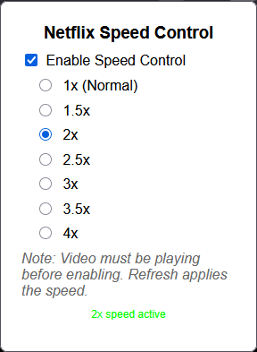

# Netflix Speed Control Firefox Extension

## Support
If you find this extension useful, consider buying me a coffee!

A simple Firefox WebExtension that allows you to control Netflix video playback speed with options for 1x (normal), 1.5x, 2x, 2.5x, 3x, 3.5x, and 4x. It includes a popup UI for toggling the feature and selecting speeds. The extension is designed for personal use and applies speed changes dynamically without needing to reload the page (except on initial enable, where a refresh is triggered).

**Note**: This extension is unofficial and for educational/personal purposes only. Respect Netflix's Terms of Service—use at your own risk. Netflix's player may change, breaking the extension.

## Features
- **Speed Options**: Choose from 1x, 1.5x, 2x, 2.5x, 3x, 3.5x, or 4x playback speeds.
- **Enable/Disable Toggle**: Checkbox to turn the speed control on/off.
- **Instant Changes**: Switch speeds mid-video without pausing or reloading (after initial enable).
- **Persistent Settings**: Your preferences (enabled state and selected speed) are saved across sessions.
- **Debug Logs**: Console logs for troubleshooting (visible in F12 DevTools on Netflix pages).
- **Default**: Starts disabled (unchecked). Defaults to 3x when enabled.

## Installation
This is a temporary (unsigned) extension for Firefox. You load it manually—no need for the Firefox Add-ons store.

### Prerequisites
- Firefox browser (version 57+ for Manifest V3 support).
- A 48x48 PNG icon file (create a simple one with "Speed" text if missing—extension works without it, but shows a default icon).

### Steps to Install
1. **Download the Files**:
   - Clone this repo or download the ZIP.
   - Extract to a folder (e.g., `NetflixSpeedControl`).

2. **Files in the Repo**:
   - `manifest.json`: Extension configuration.
   - `popup.html`: UI for the popup.
   - `popup.js`: Logic for the popup (handles toggling and speed selection).
   - `content.js`: Script that runs on Netflix pages to apply speeds.
   - `icon.png`: Toolbar icon (48x48 PNG—add your own if missing).
   - `README.md`: This file.

3. **Load in Firefox**:
   - Open Firefox and go to `about:debugging#/runtime/this-firefox`.
   - Click "Load Temporary Add-on...".
   - Navigate to your folder and select `manifest.json`.
   - The extension should load—look for the icon in your toolbar (if `icon.png` is present).

4. **Reload on Changes**: If you edit files, go back to `about:debugging`, click "Remove" then re-load, or click "Reload" on the extension.

The extension stays loaded until you close Firefox or remove it. For permanent use, zip the folder and submit to Firefox Add-ons (AMO) for signing (optional).

## How to Use
1. **Open Netflix**: Go to a Netflix watch page (e.g., https://www.netflix.com/watch/VIDEO_ID) and start playing a video. **Important**: The video must already be playing before enabling the extension (Netflix's player loads the `<video>` element on play).

2. **Open the Popup**:
   - Click the extension icon in your Firefox toolbar.
   - The popup shows:
     - A checkbox: "Enable Speed Control" (unchecked by default).
     - Radio buttons for speeds: 1x (Normal), 1.5x, 2x, 2.5x, 3x, 3.5x, 4x (defaults to 3x).
     - A note: "Note: Video must be playing before enabling. Refresh applies the speed."
     - Status message (e.g., "Inactive" or "3x speed active").

3. **Enable and Apply Speed**:
   - Select your desired speed (e.g., 3x).
   - Check the "Enable Speed Control" box.
   - The page will automatically refresh (only on enable) to inject the script.
   - After refresh, resume playing the video—the selected speed applies.
   - **Why Refresh?**: This ensures the content script hooks into Netflix's dynamic player. It only happens once per enable.

4. **Change Speed Mid-Video**:
   - While enabled and video is playing, open the popup and select a new speed (e.g., 2.5x).
   - The change applies instantly—no refresh or pause needed.

5. **Disable**:
   - Uncheck the box: Resets to normal (1x) speed instantly, without refresh.

6. **Troubleshooting**:
   - **No Effect?**: Ensure the video is playing before enabling. Check Firefox Console (F12 on Netflix page) for logs like "Set to 3x". If no logs, reload the extension.
   - **Icon Missing?**: Add a valid `icon.png` (48x48 PNG) and reload the extension.
   - **Errors?**: In popup Console (right-click popup > Inspect > Console), look for issues. Clear storage via `about:debugging` > Inspect Extension > Storage tab.
   - **Netflix Changes**: If Netflix updates their player (e.g., hides `<video>` deeper), the extension might break—fork and fix!

## Caveats
- Works only on Netflix watch pages (`/watch/*`).
- Netflix might reset speeds on skips/seeks—extension re-applies on play events.
- For personal use only; not affiliated with Netflix.
- Tested on Firefox 143+—may not work on older versions or other browsers (Chrome MV3 compatible with tweaks).
- No guarantees—Netflix could block speed changes in future updates.

## License
This project is licensed under the MIT License—feel free to modify and share!

MIT License

Copyright (c) 2025 [Your Name or GitHub Username]

Permission is hereby granted, free of charge, to any person obtaining a copy of this software and associated documentation files (the "Software"), to deal in the Software without restriction, including without limitation the rights to use, copy, modify, merge, publish, distribute, sublicense, and/or sell copies of the Software, and to permit persons to whom the Software is furnished to do so, subject to the following conditions:

The above copyright notice and this permission notice shall be included in all copies or substantial portions of the Software.

THE SOFTWARE IS PROVIDED "AS IS", WITHOUT WARRANTY OF ANY KIND, EXPRESS OR IMPLIED, INCLUDING BUT NOT LIMITED TO THE WARRANTIES OF MERCHANTABILITY, FITNESS FOR A PARTICULAR PURPOSE AND NONINFRINGEMENT. IN NO EVENT SHALL THE AUTHORS OR COPYRIGHT HOLDERS BE LIABLE FOR ANY CLAIM, DAMAGES OR OTHER LIABILITY, WHETHER IN AN ACTION OF CONTRACT, TORT OR OTHERWISE, ARISING FROM, OUT OF OR IN CONNECTION WITH THE SOFTWARE OR THE USE OR OTHER DEALINGS IN THE SOFTWARE.

## Contributing
Fork the repo, make changes, and PR! Issues welcome for bugs or feature requests (e.g., more speeds, keyboard shortcuts).

Enjoy faster Netflix bingeing! 🚀
